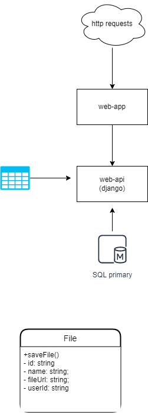

File uploader empowered by Django



### Docker build

```
docker build -t carloszan/django-file-uploader-api:v1 .
```

### Docker run

```
docker run -d -p 8000:8000 carloszan/django-file-uploader-api:v1
```

### Env

```
.\propylon\Scripts\activate
```

### Todo

- [ ] (GET) /files
- [ ] ?Continuous Delivery?

### In Progress

- [ ] (POST) /files

### Done ✓

- [x] Create app Files
- [x] Dockerfile
- [x] Create docs
- [x] (POST) /api/auth/login
- [x] Login page
